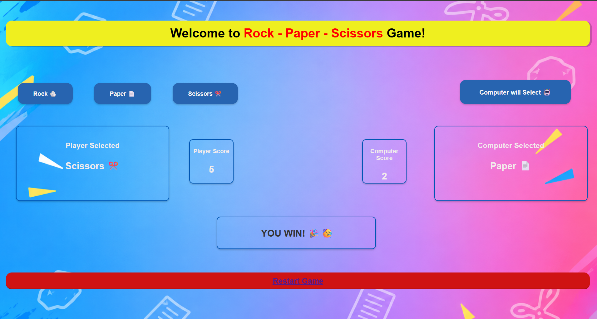

# 🎮 Rock Paper Scissors Game

A simple **Rock Paper Scissors web game** built using **Python, Flask, HTML, and CSS**.

The player selects Rock, Paper, or Scissors. Flask receives the player's choice, randomly selects a choice for the computer, compares both choices, and displays the result along with the scores.

## 🚀 Features

* 🪨 Rock, 📄 Paper, and ✂️ Scissors choices
* 🤖 Random computer selection
* 🏆 Automatic winner calculation
* 🎉 Emoji result messages
* 📊 Player and computer score tracking
* 🔄 Restart/Reset game option
* 🎨 Custom background and styled interface
* 🎊 Win celebration with confetti animation
* 🌐 Runs in a web browser using Flask

## 🛠️ Technologies Used

* **Python**
* **Flask**
* **NumPy**
* **HTML5**
* **CSS3**
* **Jinja2**

## 📁 Project Structure

```text
Game/
│
├── app.py
│
├── templates/
│   └── index.html
│
└── static/
    └── background.png
```

## ⚙️ How It Works

The game follows this simple flow:

```text
Player clicks a button
        ↓
HTML form sends choice to Flask
        ↓
Flask receives the choice
        ↓
Computer randomly selects Rock/Paper/Scissors
        ↓
Python compares both choices
        ↓
Winner is calculated
        ↓
Result and scores are sent to HTML
        ↓
Result is displayed on the webpage
```

## 🐍 Python / Flask

The Flask application handles the game logic.

The player's choice is received using:

```python
user_input = request.form["choice"].lower()
```

The computer's choice is generated randomly using NumPy:

```python
computer_value = np.random.randint(1, 4)
```

The result is then calculated by comparing the player's choice with the computer's choice.

## 🎨 HTML & Jinja2

Jinja2 is used to display the values received from Flask.

For example:

```html

    <p class="score-font">{{ result }} 🎉🥳</p>


    <p class="score-font">{{ result }} 🤖😅</p>


    <p class="score-font">{{ result }} 🤝🤝</p>


    <p>Result</p>

```

This allows the webpage to display a different emoji depending on the result.

## 🏆 Score System

The game keeps track of:

* 👤 Player Score
* 🤖 Computer Score

When the player wins:

```python
User_Score += 1
```

When the computer wins:

```python
Computer_Score += 1
```

The **Restart Game** option resets both scores to `0`.

## 💻 Installation

### 1. Clone the repository

```bash
git clone YOUR_GITHUB_REPOSITORY_URL
```

### 2. Open the project folder

```bash
cd Game
```

### 3. Install the required packages

```bash
pip install flask numpy
```

### 4. Run the Flask application

```bash
python app.py
```

### 5. Open the game

Open your browser and visit:

```text
http://127.0.0.1:5000
```

## 🎮 How to Play

1. Open the game in your browser.
2. Click **Rock**, **Paper**, or **Scissors**.
3. The computer randomly selects its choice.
4. The game determines the winner.
5. Your score is updated automatically.
6. Click **Restart Game** to reset the scores.

## 📌 Game Rules

| Player      | Computer    | Result        |
| ----------- | ----------- | ------------- |
| Rock 🪨     | Scissors ✂️ | Player Wins   |
| Paper 📄    | Rock 🪨     | Player Wins   |
| Scissors ✂️ | Paper 📄    | Player Wins   |
| Same Choice | Same Choice | Tie           |
| Other Cases | Other Cases | Computer Wins |


## Screenshots




## 👨‍💻 Author

**Sagar**

This project was created as a learning project to practice **Python, Flask, HTML, CSS, and basic web development**.
